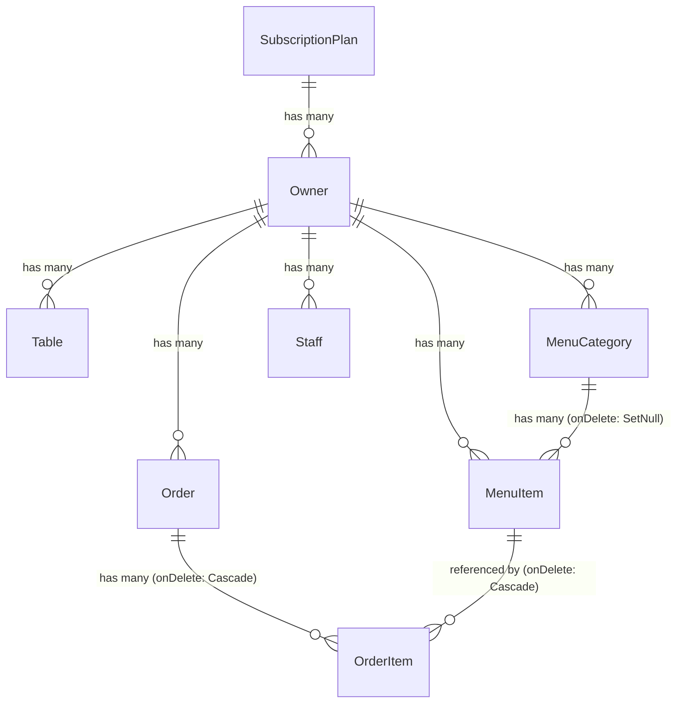

# QRestro — Complete Project Bible

> **Last Updated:** 2026-07-07  
> **Purpose:** This file is the single source of truth for the entire QRestro platform. It documents every feature, every file, every API endpoint, every database model, every data flow, and every architectural decision. Share this file with any AI assistant or developer to instantly provide full context about the project — no re-analysis needed.

> [!IMPORTANT]
> **Update this file after every significant change to the codebase.** Add new features, modify API signatures, update database schemas, or note any architectural shifts here so this remains the canonical reference.

---

## Table of Contents

1. [Product Overview](#1-product-overview)
2. [Tech Stack & Dependencies](#2-tech-stack--dependencies)
3. [Project Structure (File Map)](#3-project-structure-file-map)
4. [Environment Variables](#4-environment-variables)
5. [Database Schema (Prisma Models)](#5-database-schema-prisma-models)
6. [Authentication & Authorization System](#6-authentication--authorization-system)
7. [Real-Time Communication (Socket.io)](#7-real-time-communication-socketio)
8. [API Endpoints — Complete Reference](#8-api-endpoints--complete-reference)
9. [Frontend Pages — Complete Reference](#9-frontend-pages--complete-reference)
10. [Feature Deep-Dives](#10-feature-deep-dives)
11. [Security Mechanisms](#11-security-mechanisms)
12. [Design System & Theme](#12-design-system--theme)
13. [Development Commands](#13-development-commands)
14. [Data Flow Diagrams](#14-data-flow-diagrams)
15. [Seed Data & Demo Accounts](#15-seed-data--demo-accounts)
16. [Known Conventions & Patterns](#16-known-conventions--patterns)
17. [Changelog](#17-changelog)

---

## 1. Product Overview

**QRestro** is a multi-tenant SaaS platform for restaurant QR-code-based table ordering. The system has **four user roles** and **five main interfaces**:

### User Roles

| Role | Description | Access |
|------|-------------|--------|
| **Super Admin** | Platform administrator | `/superadmin` dashboard, manages all restaurants |
| **Restaurant Owner** | Registers & manages one restaurant | `/dashboard` — full menu, tables, orders, billing, reports, staff, settings |
| **Staff** (Waiter/Chef/Cashier/Manager) | Employees of a restaurant | `/staff/login`, `/staff/waiter`, `/staff/cashier`, `/dashboard/kds` (Chef) |
| **Customer** | Diner at a table | `/order/[ownerId]/[tableNumber]` — scans QR, browses menu, places orders |

### Core Value Proposition
1. Restaurant owner registers → gets auto-generated tables with QR codes.
2. QR codes are printed and placed on physical tables.
3. Customers scan QR → see the digital menu → place orders directly from their phone.
4. Orders appear in real-time on the owner's dashboard (Kanban board) via Socket.io.
5. Owner/staff manage the order lifecycle: `Pending → Preparing → Ready → Completed`.

---

## 2. Tech Stack & Dependencies

| Layer | Technology | Version | Purpose |
|-------|-----------|---------|---------|
| **Framework** | Next.js (App Router) | 16.2.9 | Full-stack React framework with Turbopack |
| **Language** | TypeScript | — | Strict typing throughout |
| **Database** | PostgreSQL | — | Primary data store |
| **ORM** | Prisma | 6.19.3 | Database access, schema management, migrations |
| **Styling** | Tailwind CSS v4 + Vanilla CSS Variables | v4 | Utility classes + custom design system |
| **Real-time** | Socket.io | 4.8.3 | WebSocket communication for live order updates |
| **Auth** | jsonwebtoken (JWT) + bcryptjs | 9.0.3 / 3.0.3 | Token-based auth with password hashing |
| **QR Generation** | qrcode (npm) | 1.5.4 | Generate QR code images (PNG data URLs, SVG) |
| **Icons** | lucide-react | 1.21.0 | Icon library |
| **Server Runtime** | Custom Node.js HTTP server (`server.ts`) | — | Wraps Next.js to enable Socket.io on the same port |
| **Dev Runner** | tsx | 4.22.4 | TypeScript execution for `server.ts` and seed scripts |

### Key Architectural Decision: Custom Server
Next.js runs inside a **custom HTTP server** (`server.ts`) because Socket.io requires attaching to the same HTTP server instance. The `npm run dev` command runs `tsx watch server.ts`, NOT `next dev`.

---

## 3. Project Structure (File Map)

```
restaurant-qr-ordering/
├── .env                          # Environment variables (DB URL, JWT secret, etc.)
├── AGENTS.md                     # AI agent behavioral rules
├── CLAUDE.md                     # Developer guide & design tokens reference
├── design.md                     # Apple HIG design specifications
├── PROJECT_BIBLE.md              # THIS FILE — complete project documentation
├── server.ts                     # Custom Node.js server (Next.js + Socket.io)
├── next.config.mjs               # Next.js configuration (Turbopack root)
├── package.json                  # Dependencies & scripts
├── tsconfig.json                 # TypeScript configuration
├── prisma/
│   ├── schema.prisma             # Database schema (all models)
│   └── seed.ts                   # Seed script (plans, super admin, demo data)
├── public/
│   ├── images/                   # Static images
│   └── uploads/                  # User-uploaded files (local storage mode)
└── src/
    ├── proxy.ts                  # Middleware for route protection (auth guards)
    ├── lib/                      # Shared utilities
    │   ├── api.ts                # Client-side auth header helper (getAuthHeader)
    │   ├── audio.ts              # Web Audio API notification chime
    │   ├── auth.ts               # JWT token generation/verification, password hashing
    │   ├── db.ts                 # Prisma client singleton
    │   ├── qr.ts                 # QR code generation (PNG data URL, SVG, order URL builder)
    │   ├── rateLimit.ts          # In-memory IP-based rate limiter
    │   ├── security.ts           # HMAC table signatures, session tokens
    │   ├── socketServer.ts       # Server-side Socket.io helpers (getIO, emitToRestaurant)
    │   ├── storage.ts            # File upload utility (local filesystem or Base64 DB)
    │   └── useSocket.ts          # Client-side React hook for Socket.io
    ├── components/
    │   └── .gitkeep              # Placeholder for reusable UI components
    └── app/
        ├── globals.css           # Master stylesheet (105KB — full design system)
        ├── layout.tsx            # Root layout (fonts, ThemeProvider, meta)
        ├── ThemeProvider.tsx      # Client component: syncs localStorage theme → HTML attr
        ├── page.tsx              # Landing page (/)
        ├── error.tsx             # Global error boundary
        ├── auth/
        │   ├── login/page.tsx    # Owner login page
        │   └── register/page.tsx # Owner registration page
        ├── dashboard/
        │   ├── layout.tsx        # Dashboard shell (sidebar, nav, mobile drawer)
        │   ├── page.tsx          # Dashboard home (stats, recent orders)
        │   ├── menu/page.tsx     # Menu management (CRUD items + categories)
        │   ├── tables/page.tsx   # Table & QR management
        │   ├── orders/page.tsx   # Live order Kanban board
        │   ├── billing/page.tsx  # Table billing & bill settlement
        │   ├── reports/page.tsx  # Analytics & reports (charts, top items)
        │   ├── staff/page.tsx    # Staff management (CRUD staff members)
        │   ├── settings/page.tsx # Restaurant profile settings
        │   └── kds/page.tsx      # Kitchen Display System (Chef view)
        ├── order/
        │   └── [ownerId]/
        │       └── [tableNumber]/
        │           ├── page.tsx          # Customer ordering page
        │           └── success/page.tsx  # Order success confirmation
        ├── staff/
        │   ├── login/page.tsx    # Staff login (phone+PIN or restaurant code)
        │   ├── waiter/page.tsx   # Waiter mobile interface
        │   └── cashier/page.tsx  # Cashier billing interface
        ├── superadmin/
        │   ├── layout.tsx        # Superadmin dashboard shell
        │   ├── page.tsx          # Superadmin home (platform stats)
        │   └── restaurants/page.tsx # Restaurant management
        ├── uploads/              # Upload serving route
        └── api/                  # API Route Handlers (see Section 8)
            ├── auth/             # Authentication endpoints
            ├── billing/          # Billing & settlement
            ├── categories/       # Menu categories CRUD
            ├── menu/             # Menu items CRUD
            ├── orders/           # Order management
            ├── public/           # Unauthenticated public endpoints
            ├── reports/          # Analytics data
            ├── service-request/  # Customer service requests (waiter/water)
            ├── staff/            # Staff CRUD + auth
            ├── stats/            # Dashboard statistics
            ├── superadmin/       # Platform admin endpoints
            ├── tables/           # Table CRUD
            └── upload/           # File upload
```

---

## 4. Environment Variables

| Variable | Required | Description |
|----------|----------|-------------|
| `DATABASE_URL` | ✅ | PostgreSQL connection string |
| `JWT_SECRET` | ✅ | Secret key for JWT signing (fatal error if missing) |
| `NEXT_PUBLIC_APP_URL` | ❌ | Public URL for QR code generation (e.g., `https://qrestro.com`) |
| `STORAGE_PROVIDER` | ❌ | `local` (default on VPS) or `database` (Base64, default on Vercel) |
| `VERCEL` | ❌ | Auto-set by Vercel; triggers `database` storage provider |
| `PORT` | ❌ | Server port (default: `3000`) |
| `HOSTNAME` | ❌ | Server hostname (default: `localhost`) |
| `NODE_ENV` | ❌ | `development` or `production` |

---

## 5. Database Schema (Prisma Models)

### Enums

```
Role:       SUPER_ADMIN | RESTAURANT_OWNER
PlanTier:   FREE | PRO | PREMIUM
StaffRole:  MANAGER | WAITER | CHEF | CASHIER
```

### Models & Relationships



### Model Details

#### SubscriptionPlan (`subscription_plans`)
| Field | Type | Notes |
|-------|------|-------|
| id | UUID | Primary key |
| tier | PlanTier | UNIQUE — `FREE`, `PRO`, `PREMIUM` |
| price | Decimal(10,2) | Monthly price |
| maxTables | Int | Max tables allowed on this plan |
| features | String[] | Feature description list |
| createdAt/updatedAt | DateTime | Timestamps |

#### Owner (`owners`)
| Field | Type | Notes |
|-------|------|-------|
| id | UUID | Primary key |
| username | String(255) | UNIQUE — used as login & "restaurant code" for staff |
| email | String(255) | UNIQUE |
| passwordHash | String(255) | bcrypt hash |
| restaurantName | String(255)? | Display name |
| ownerName | String(255)? | Person's name |
| phone | String(50)? | Contact phone |
| role | Role | `RESTAURANT_OWNER` (default) or `SUPER_ADMIN` |
| planId | UUID? | FK → SubscriptionPlan |
| subscriptionStatus | String(50) | Default: `"active"` |
| showOnLanding | Boolean | Default: `false` — featured on landing page |
| cuisine | String(100)? | Restaurant cuisine type |
| createdAt/updatedAt | DateTime | Timestamps |

**Relations:** plan, tables[], menuItems[], categories[], orders[], staff[]

#### Table (`tables`)
| Field | Type | Notes |
|-------|------|-------|
| id | UUID | Primary key |
| ownerId | UUID | FK → Owner (Cascade delete) |
| tableNumber | Int | UNIQUE per owner |
| qrCodeData | Text | The full URL encoded in QR (e.g., `https://domain/order/{ownerId}/{tableNumber}?code={signature}`) |
| qrCodeImageUrl | Text? | Base64 PNG data URL of the QR code image |
| isActive | Boolean | Default: `true` |
| createdAt/updatedAt | DateTime | `updatedAt` is also used as session boundary for billing |

**Unique constraint:** `[ownerId, tableNumber]`

> [!IMPORTANT]
> The `updatedAt` field on `Table` has a dual purpose: it serves as the **session boundary marker**. When a bill is settled, `updatedAt` is "touched" to a new timestamp, effectively resetting the table session. All orders with `createdAt > table.updatedAt` belong to the current session.

#### MenuCategory (`menu_categories`)
| Field | Type | Notes |
|-------|------|-------|
| id | UUID | Primary key |
| ownerId | UUID | FK → Owner (Cascade delete) |
| name | String(100) | Category name |
| description | Text? | Optional description |
| sortOrder | Int | Display order (default: 0, auto-incremented) |
| createdAt/updatedAt | DateTime | Timestamps |

**Relations:** owner, items[] (MenuItem)

#### MenuItem (`menu_items`)
| Field | Type | Notes |
|-------|------|-------|
| id | UUID | Primary key |
| ownerId | UUID | FK → Owner (Cascade delete) |
| categoryId | UUID? | FK → MenuCategory (SetNull on delete) |
| name | String(255) | Item name |
| description | Text? | Item description |
| price | Decimal(10,2) | Price (₹) |
| imageUrl | Text? | Image URL or Base64 data URL |
| preparationTime | Int | Minutes (default: 15) |
| isAvailable | Boolean | Default: `true` |
| createdAt/updatedAt | DateTime | Timestamps |

**Relations:** owner, category?, orderItems[]

#### Order (`orders`)
| Field | Type | Notes |
|-------|------|-------|
| id | UUID | Primary key |
| ownerId | UUID | FK → Owner (Cascade delete) |
| tableNumber | Int | Which table placed the order |
| totalAmount | Decimal(10,2) | Calculated server-side from item prices × quantities |
| estimatedTime | Int | Max preparation time among all items (minutes) |
| status | String(50) | `pending` → `preparing` → `ready` → `completed` / `cancelled` |
| placedBy | String(100)? | `"QR"` (customer), `"OWNER"`, or `"WAITER:{name}"` |
| notes | Text? | Customer order notes |
| cancellationReason | Text? | Required when status = `cancelled` |
| createdAt | DateTime | Order placement time |
| completedAt | DateTime? | Set when status changes to `completed` |
| updatedAt | DateTime | Timestamps |

**Relations:** owner, items[] (OrderItem)

**Valid Statuses:** `pending`, `preparing`, `ready`, `completed`, `cancelled`

#### OrderItem (`order_items`)
| Field | Type | Notes |
|-------|------|-------|
| id | UUID | Primary key |
| orderId | UUID | FK → Order (Cascade delete) |
| menuItemId | UUID | FK → MenuItem (Cascade delete) |
| menuItemName | String(255) | Snapshot of item name at order time |
| quantity | Int | How many of this item |
| price | Decimal(10,2) | Unit price at order time |
| createdAt | DateTime | Timestamp |

#### Staff (`staff`)
| Field | Type | Notes |
|-------|------|-------|
| id | UUID | Primary key |
| ownerId | UUID | FK → Owner (Cascade delete) |
| name | String(100) | Staff member name |
| phone | String(50)? | Phone number (unique per owner) |
| pinHash | String(255) | bcrypt hash of 4-6 digit PIN |
| role | StaffRole | `MANAGER`, `WAITER`, `CHEF`, `CASHIER` |
| assignedTables | Int[] | Array of table numbers (for waiters) |
| isActive | Boolean | Default: `true` |
| createdAt/updatedAt | DateTime | Timestamps |

**Unique constraint:** `[ownerId, phone]`

---

## 6. Authentication & Authorization System

### Dual Token Architecture

QRestro uses **two separate JWT token systems** that coexist:

| Token Type | Cookie Name | localStorage Key | Expiry | Payload |
|-----------|-------------|-------------------|--------|---------|
| **Owner Token** | `token` | `token` | 24 hours | `{ id, username, email, role }` |
| **Staff Token** | `staffToken` | `staffToken` | 12 hours | `{ staffId, ownerId, name, role, isStaff: true }` |

### How Token Discrimination Works
- Owner tokens do NOT have `isStaff` flag.
- Staff tokens ALWAYS have `isStaff: true`.
- `verifyToken()` rejects tokens with `isStaff = true` → ensures staff can't impersonate owners.
- `verifyStaffToken()` rejects tokens without `isStaff = true` → ensures owners can't impersonate staff.

### Authentication Functions (`src/lib/auth.ts`)

| Function | Purpose |
|----------|---------|
| `generateToken(payload)` | Creates owner JWT (24h expiry) |
| `verifyToken(token)` | Validates owner JWT, returns `TokenPayload | null` |
| `hashPassword(password)` | bcrypt hash (10 rounds) |
| `comparePassword(password, hash)` | bcrypt compare |
| `getTokenFromRequest(request)` | Extracts Bearer token from Authorization header |
| `authenticateRequest(request)` | Full owner auth: checks header → cookie → verify |
| `generateStaffToken(payload)` | Creates staff JWT (12h expiry) |
| `verifyStaffToken(token)` | Validates staff JWT, returns `StaffTokenPayload | null` |
| `authenticateStaffRequest(request)` | Full staff auth: checks header → staffToken cookie |
| `authenticateAnyRequest(request)` | Tries owner first, then staff; returns `{ type, user/staff }` |

### Client-Side Auth (`src/lib/api.ts`)
- `getAuthHeader()` → reads `token` from `localStorage`, returns `{ Authorization: 'Bearer ...', 'Content-Type': 'application/json' }`.
- All dashboard fetch calls use this header.

### Route Protection Middleware (`src/proxy.ts`)

| Route Pattern | Protection |
|--------------|------------|
| `/dashboard/*` | Requires valid owner token (cookie or header) |
| `/dashboard/kds` | Also allows CHEF staff token |
| `/superadmin/*` | Requires owner token with `role === 'SUPER_ADMIN'` |
| `/staff/waiter/*` | Requires staff token with `role === 'WAITER'` |
| `/staff/cashier/*` | Requires staff token with `role === 'CASHIER'` |
| `/order/*` | No auth (public) — validated via QR code signature + session token |

---

## 7. Real-Time Communication (Socket.io)

### Architecture

```
┌─────────────────┐     ┌──────────────────┐     ┌─────────────────────┐
│  Customer Page   │     │  Custom Server    │     │  Owner Dashboard    │
│  (places order)  │────▶│  (server.ts)      │────▶│  (listens to room)  │
│                  │     │  Socket.io Server  │     │                     │
└─────────────────┘     │  Path: /api/socketio│    └─────────────────────┘
                         └──────────────────┘
```

### Server Setup (`server.ts`)
- Socket.io server attached to the custom HTTP server on path `/api/socketio`.
- Transports: `websocket` (primary), `polling` (fallback).
- The `io` instance is stored globally: `globalThis.__io = io`.
- Ping interval: 25s, Ping timeout: 20s.

### Room System
- Each restaurant owner has a room: `restaurant:{ownerId}`.
- Clients join by emitting `join-restaurant` with the owner's ID.
- Server-side emission targets the room via `emitToRestaurant(ownerId, event, data)`.

### Socket Events

| Event | Direction | Emitted By | Payload | Description |
|-------|-----------|-----------|---------|-------------|
| `join-restaurant` | Client → Server | Dashboard pages | `ownerId: string` | Client joins the restaurant's room |
| `order:new` | Server → Client | `POST /api/orders`, `POST /api/service-request` (water) | Full formatted order object | New order placed |
| `order:updated` | Server → Client | `PUT /api/orders/[id]`, `PUT /api/billing` | Full formatted order or `{ id, status }` | Order status changed |
| `menu:updated` | Server → Client | `PUT /api/menu/[id]` | Updated menu item | Menu item edited |
| `menu:deleted` | Server → Client | `DELETE /api/menu/[id]` | `{ id }` | Menu item deleted |
| `service:request` | Server → Client | `POST /api/service-request` | `{ tableNumber, type, timestamp }` | Customer pressed "Call Waiter" or "Request Water" |
| `table:reset` | Server → Client | `PUT /api/billing` (settle bill) | `{ tableNumber }` | Table session reset (bill settled) |

### Client Hook (`src/lib/useSocket.ts`)
- `useSocket(ownerId, listeners)` — connects to Socket.io, joins room, attaches event handlers.
- Auto-reconnects with exponential backoff (1s–5s, infinite attempts).
- Returns `{ connected: boolean }`.

---

## 8. API Endpoints — Complete Reference

### Authentication (`/api/auth/*`)

| Method | Path | Auth | Rate Limit | Description |
|--------|------|------|------------|-------------|
| POST | `/api/auth/login` | ❌ | 10/min | Login with username + password → returns JWT + owner data |
| POST | `/api/auth/register` | ❌ | 5/min | Register new restaurant (creates owner + N tables with QR codes) |
| GET | `/api/auth/verify` | ✅ Owner | — | Verify token validity, returns user payload |
| GET | `/api/auth/profile` | ✅ Owner | — | Get owner profile (name, email, phone, cuisine) |
| PUT | `/api/auth/profile` | ✅ Owner | — | Update owner profile fields |
| POST | `/api/auth/change-password` | ✅ Owner | 5/min | Change password (requires current + new password) |

**Registration Flow:**
1. Validates all required fields (restaurantName, ownerName, email, username ≥3 chars, password ≥6 chars, tableCount).
2. Checks username/email uniqueness.
3. Finds or creates FREE subscription plan.
4. Enforces table count ≤ plan's maxTables.
5. Creates owner record.
6. For each table (1..N): generates signed order URL → generates QR code PNG data URL → creates Table record.
7. Returns success with restaurant info.

---

### Menu Items (`/api/menu/*`)

| Method | Path | Auth | Description |
|--------|------|------|-------------|
| GET | `/api/menu` | ✅ Owner OR `?ownerId=` | List menu items. If `ownerId` query param is given, returns that owner's items (public). Otherwise requires auth. |
| POST | `/api/menu` | ✅ Owner | Create new menu item (name, price required; description, preparationTime, isAvailable, categoryId, imageUrl optional) |
| GET | `/api/menu/[id]` | ✅ Owner | Get single menu item |
| PUT | `/api/menu/[id]` | ✅ Owner | Update menu item (partial update). **Emits `menu:updated` via Socket.io** |
| DELETE | `/api/menu/[id]` | ✅ Owner | Delete menu item. **Emits `menu:deleted` via Socket.io** |

---

### Menu Categories (`/api/categories/*`)

| Method | Path | Auth | Description |
|--------|------|------|-------------|
| GET | `/api/categories` | ✅ Owner | List categories (sorted by sortOrder, includes item count) |
| POST | `/api/categories` | ✅ Owner | Create category (name required, auto-increments sortOrder) |
| PUT | `/api/categories/[id]` | ✅ Owner | Update category (name, description, sortOrder) |
| DELETE | `/api/categories/[id]` | ✅ Owner | Delete category (items become uncategorized via SetNull) |

---

### Tables (`/api/tables/*`)

| Method | Path | Auth | Description |
|--------|------|------|-------------|
| GET | `/api/tables` | ✅ Owner | List all tables. **Auto-repairs** QR codes that have incorrect format, missing images, stale localhost URLs, or invalid HMAC signatures |
| POST | `/api/tables` | ✅ Owner | Create new table. Enforces subscription plan table limit |
| GET | `/api/tables/[id]` | ✅ Owner | Get single table |
| PUT | `/api/tables/[id]` | ✅ Owner | Update table (isActive, regenerateQR flag) |
| DELETE | `/api/tables/[id]` | ✅ Owner | Delete table |

**QR Auto-Repair Logic (GET /api/tables):**
On each fetch, every table's QR data is checked for:
- JSON format (legacy bug) → regenerate
- Localhost URL when deployed to production → regenerate
- Missing QR image → regenerate
- Invalid HMAC signature → regenerate

---

### Orders (`/api/orders/*`)

| Method | Path | Auth | Description |
|--------|------|------|-------------|
| GET | `/api/orders` | ✅ Owner OR Staff | List orders (filterable by `?status=`, `?tableNumber=`, `?limit=`). Default limit: 50 |
| POST | `/api/orders` | ✅ Owner/Staff OR Public (with sessionToken) | Place order. **Emits `order:new` via Socket.io** |
| GET | `/api/orders/[id]` | ✅ Owner OR Staff | Get single order with items |
| PUT | `/api/orders/[id]` | ✅ Owner OR Staff | Update order status. Requires `cancellationReason` when cancelling. **Emits `order:updated` via Socket.io** |

**Order Placement Flow (POST /api/orders):**
1. Determines `placedBy` based on auth: `OWNER`, `WAITER:{name}`, or `QR`.
2. Rate-limits only public (unauthenticated) orders: 10/min.
3. Validates table exists and is active.
4. For public orders: verifies `sessionToken` against `table.updatedAt`.
5. Validates all menu item IDs exist, belong to owner, and are available.
6. Calculates `totalAmount` and `estimatedTime` (max prep time).
7. Creates order + items in a single Prisma query.
8. Emits `order:new` socket event.

---

### Billing (`/api/billing`)

| Method | Path | Auth | Description |
|--------|------|------|-------------|
| GET | `/api/billing` | ✅ Owner | Get billing status for all tables. For each active table, aggregates all orders in the current session (orders with `createdAt > table.updatedAt`). Returns table status: `idle`, `active`, or `completed_unpaid` |
| PUT | `/api/billing` | ✅ Owner | Settle bill for a table. Marks all active session orders as `completed`, touches `table.updatedAt` to reset session. **Emits `order:updated` + `table:reset` via Socket.io** |

**Billing Session Logic:**
- A "session" is defined as: all orders for a table where `order.createdAt > table.updatedAt`.
- Settling a bill: `table.updatedAt = NOW()` → any future queries for "current session" will find no orders → table appears idle.

---

### Reports (`/api/reports`)

| Method | Path | Auth | Description |
|--------|------|------|-------------|
| GET | `/api/reports` | ✅ Owner | Analytics data. Accepts `?startDate=` and `?endDate=` (defaults: last 30 days). Returns: `metrics` (totalOrders, totalRevenue, averageTicketSize), `dailySales` (date→revenue array), `topItems` (top 10 by quantity). Only includes `completed` orders |

**Date Handling:** Uses `Intl.DateTimeFormat` with `Asia/Kolkata` timezone for consistent daily bucketing.

---

### Statistics (`/api/stats`)

| Method | Path | Auth | Description |
|--------|------|------|-------------|
| GET | `/api/stats` | ✅ Owner | Dashboard stats: totalOrders, todayOrders, todayRevenue (non-cancelled), pendingOrders (pending+preparing+ready), menuItems count, tables count |

---

### Staff Management (`/api/staff/*`)

| Method | Path | Auth | Description |
|--------|------|------|-------------|
| GET | `/api/staff` | ✅ Owner | List staff members (excludes pinHash) |
| POST | `/api/staff` | ✅ Owner | Create staff (name, pin 4-6 digits, role required; phone optional; assignedTables array optional). PIN is bcrypt-hashed |
| PUT | `/api/staff/[id]` | ✅ Owner | Update staff (name, phone, role, assignedTables, isActive, pin) |
| DELETE | `/api/staff/[id]` | ✅ Owner | Delete staff member |

### Staff Authentication (`/api/staff/auth`)

| Method | Path | Auth | Description |
|--------|------|------|-------------|
| POST | `/api/staff/auth` | ❌ | Staff login — **two modes** |
| GET | `/api/staff/auth` | ❌ | Get staff list for a restaurant code (public, names only) |

**Staff Login Modes:**
1. **Phone + PIN** (preferred, unified login): `{ phone, pin }` → finds all staff with that phone across all restaurants → tries PIN against each.
2. **Restaurant Code + Name + PIN** (legacy): `{ restaurantCode, staffName, pin }` → finds owner by username → finds staff by name → verifies PIN.

Both return: staff token + staff info + restaurant info.

---

### Service Requests (`/api/service-request`)

| Method | Path | Auth | Description |
|--------|------|------|-------------|
| POST | `/api/service-request` | ❌ (public, sessionToken required) | Customer requests service. Rate limit: 3/min |

**Service Types:**
- `"waiter"` → Emits `service:request` socket event to restaurant dashboard.
- `"water"` → Emits `service:request` AND auto-creates a water order (finds a menu item with name containing "water").

---

### File Upload (`/api/upload`)

| Method | Path | Auth | Description |
|--------|------|------|-------------|
| POST | `/api/upload` | ✅ Owner | Upload image file (FormData with `file` field). Validates MIME type (JPEG/PNG/WebP/GIF), extension, and size (≤5MB). Returns `{ url }` |

**Storage Modes (`src/lib/storage.ts`):**
- **Local** (default on VPS): Saves to `public/uploads/` with unique filename. Returns relative path `/uploads/{filename}`.
- **Database** (default on Vercel): Converts to Base64 data URL. Returns `data:{mime};base64,...`.

---

### Public Endpoints (`/api/public/*`)

These endpoints are accessed by **customers** without authentication. They use QR code signatures and session tokens for security.

| Method | Path | Auth | Rate Limit | Description |
|--------|------|------|------------|-------------|
| GET | `/api/public/featured` | ❌ | — | Get restaurants with `showOnLanding = true` (for landing page) |
| GET | `/api/public/menu` | ❌ | 60/min | Get menu for a table. Requires `ownerId`, `tableNumber`, and either `code` (HMAC signature from QR) or `sessionToken`. Returns: restaurant info, flat items list, categorized items, uncategorized items, sessionToken |
| GET | `/api/public/orders` | ❌ | 60/min | Get current session orders for a table. Requires `ownerId`, `tableNumber`, `sessionToken`. Returns orders where `createdAt > table.updatedAt` |

**Public Menu Access Flow:**
1. Customer scans QR → URL has `?code={hmac_signature}`.
2. First request: validates `code` → returns data + `sessionToken` (JWT tied to `table.updatedAt`).
3. Subsequent requests: uses `sessionToken` instead of `code`.
4. If table is "reset" (bill settled), `table.updatedAt` changes → old session tokens become invalid → customer must re-scan QR.

---

### Super Admin (`/api/superadmin/*`)

| Method | Path | Auth | Description |
|--------|------|------|-------------|
| GET | `/api/superadmin/stats` | ✅ Super Admin | Platform-wide stats: totalRestaurants, totalOrders, platformRevenue (all completed orders), activeTables |
| GET | `/api/superadmin/restaurants` | ✅ Super Admin | List all restaurant owners with plan, table count, order count |
| PUT | `/api/superadmin/restaurants` | ✅ Super Admin | Update a restaurant: change plan tier, toggle `showOnLanding`, set cuisine. Auto-creates plan if tier doesn't exist |

---

## 9. Frontend Pages — Complete Reference

### Landing Page (`/`)
- **File:** `src/app/page.tsx` (33KB)
- Public marketing page showcasing QRestro features.
- Fetches featured restaurants from `/api/public/featured`.

### Auth Pages

#### Login (`/auth/login`)
- Username + password form.
- On success: stores `token` and `owner` object in localStorage, sets `token` cookie, redirects to `/dashboard`.
- Superadmin users are redirected to `/superadmin`.

#### Register (`/auth/register`)
- Multi-field form: restaurant name, owner name, email, phone, username, password, table count.
- On success: redirects to `/auth/login` with success message.

### Owner Dashboard (`/dashboard/*`)

#### Dashboard Layout (`/dashboard/layout.tsx` — 24KB)
- Full sidebar navigation with mobile hamburger drawer.
- Theme toggle (light/dark).
- Logout button (clears localStorage + cookies, redirects to `/`).
- Navigation items: Dashboard, Menu, Tables, Orders, Billing, Reports, Staff, KDS, Settings.
- Shows service request notifications (waiter/water calls) as floating alerts with audio chime.
- Connects to Socket.io for real-time service request alerts.

#### Dashboard Home (`/dashboard`)
- Shows 6 stat cards: Today's Orders, Today's Revenue, Active Orders, Menu Items, Tables, Total Orders.
- Recent orders table (last 8 orders).
- Real-time updates via Socket.io (auto-refreshes on `order:new`, `order:updated`).

#### Menu Management (`/dashboard/menu`)
- **File:** `src/app/dashboard/menu/page.tsx`
- Full CRUD for menu items and categories.
- Image upload via `/api/upload`.
- Category filtering and creation.
- Availability toggle, price editing, preparation time.

#### Table & QR Management (`/dashboard/tables`)
- **File:** `src/app/dashboard/tables/page.tsx`
- Lists all tables with QR code previews.
- Add new tables (enforces plan limits).
- Toggle active/inactive.
- Download QR as SVG or PNG.
- Delete tables.

#### Live Orders Kanban (`/dashboard/orders`)
- **File:** `src/app/dashboard/orders/page.tsx`
- Kanban-style board with columns: Pending, Preparing, Ready.
- Drag-and-drop (click to advance) order status progression.
- Real-time updates via Socket.io.
- Cancel order with required reason.
- Audio notification chime on new orders.

#### Billing (`/dashboard/billing` — 23KB)
- Shows all tables with their current session status.
- For each table: lists collated items, individual order statuses, total amount.
- "Settle Bill" button: completes all orders + resets table session.
- Three states per table: `idle` (green), `active` (orange), `completed_unpaid` (blue/ready to settle).

#### Reports & Analytics (`/dashboard/reports` — 17KB)
- Date range picker (defaults to last 30 days).
- KPI cards: Total Orders, Total Revenue, Average Ticket Size.
- Daily revenue bar chart (CSS-based, no chart library).
- Top selling items ranked list.

#### Staff Management (`/dashboard/staff` — 22KB)
- Full CRUD for staff members.
- Create: name, phone, PIN (4-6 digits), role selection, table assignment.
- Edit: all fields including PIN reset.
- Activate/deactivate toggle.
- Delete with confirmation.

#### Kitchen Display System (`/dashboard/kds` — 13KB)
- Real-time view of pending and preparing orders.
- Designed for kitchen monitor/tablet use.
- Accessible by both owners AND staff with CHEF role.
- Shows order items, table number, elapsed time.
- One-tap status advancement (Pending → Preparing → Ready).

#### Settings (`/dashboard/settings`)
- **File:** `src/app/dashboard/settings/page.tsx`
- Edit restaurant name, owner name, email, phone, cuisine.
- Change password (current + new password).
- View subscription plan info.

### Customer Ordering (`/order/[ownerId]/[tableNumber]`)

#### Customer Menu & Cart (`/order/[ownerId]/[tableNumber]/page.tsx` — 38KB)
- **Fully public** — no login required.
- Security: validates QR code HMAC signature OR session token.
- Mobile-first responsive design.
- Browse menu by categories.
- Search items.
- Add to cart with quantity adjustment.
- Order notes support.
- Sticky bottom cart bar.
- "Call Waiter" and "Request Water" service buttons.
- View current session orders with status tracking.
- Real-time order status updates via Socket.io.
- Session expiry handling (shows "scan QR again" message).

#### Order Success (`/order/[ownerId]/[tableNumber]/success`)
- Confirmation page after successful order placement.
- Shows estimated preparation time.

### Staff Pages (`/staff/*`)

#### Staff Login (`/staff/login`)
- Unified login: phone + PIN.
- Routes to appropriate interface based on role (waiter → `/staff/waiter`, cashier → `/staff/cashier`, chef → `/dashboard/kds`).

#### Waiter Interface (`/staff/waiter`)
- Mobile-optimized for waiters.
- View assigned tables and their orders.
- Place orders on behalf of customers.
- Update order statuses.

#### Cashier Interface (`/staff/cashier`)
- Table billing and settlement.
- View active table sessions with collated bills.
- Settle bills (same flow as owner billing).

### Super Admin (`/superadmin/*`)

#### Super Admin Layout (`/superadmin/layout.tsx` — 20KB)
- Separate dashboard shell for platform admin.
- Navigation: Dashboard, Restaurants.

#### Super Admin Dashboard (`/superadmin/page.tsx` — 14KB)
- Platform stats: Total Restaurants, Total Orders, Platform Revenue, Active Tables.

#### Restaurant Management (`/superadmin/restaurants/page.tsx` — 13KB)
- Lists all restaurant owners.
- Edit plan tier (FREE/PRO/PREMIUM).
- Toggle "show on landing page".
- View restaurant stats (tables, orders).

---

## 10. Feature Deep-Dives

### 10.1 QR Code System

**Generation Flow:**
1. `buildOrderUrl(ownerId, tableNumber, requestHost)` in `src/lib/qr.ts`:
   - Computes HMAC signature: `HMAC-SHA256(JWT_SECRET, "{ownerId}:{tableNumber}")` → first 16 hex chars.
   - Builds URL: `{protocol}://{host}/order/{ownerId}/{tableNumber}?code={signature}`.
   - Priority for base URL: `NEXT_PUBLIC_APP_URL` (if not localhost) → request host header → env fallback.
2. `generateQRCodeDataURL(url)` → returns Base64 PNG (400px, error correction M).
3. `generateQRCodeSVG(url)` → returns SVG string.

**Download Options:**
- SVG download: raw SVG file download.
- PNG download: converts QR code image to downloadable PNG.

### 10.2 Table Session System

The session system prevents:
- Customers from the previous sitting seeing old orders.
- Old customers placing new orders after they've left.

**How it works:**
1. Each `Table` has an `updatedAt` timestamp.
2. When customer scans QR → gets a `sessionToken` (JWT containing `tableId` + `tableUpdatedAt`).
3. All subsequent requests send `sessionToken`.
4. Server verifies: JWT's `tableUpdatedAt` must match current `table.updatedAt`.
5. When bill is settled: `table.updatedAt` changes → all old session tokens become invalid.
6. Customer page detects `SESSION_EXPIRED` error → shows "scan QR again" message.

### 10.3 Service Requests (Call Waiter / Water)

- Customer presses "Call Waiter" or "Request Water" on the ordering page.
- Sends `POST /api/service-request` with `{ ownerId, tableNumber, type, sessionToken }`.
- Rate limited to 3 requests per minute per IP.
- **Waiter request:** Emits `service:request` socket event → dashboard shows floating alert + audio chime.
- **Water request:** Same as waiter + auto-creates an order with the first menu item containing "water" in its name.

### 10.4 Notification Sound System (`src/lib/audio.ts`)

- Uses Web Audio API (no external audio files).
- Synthesizes a two-tone chime: D5 (587.33 Hz) + A5 (880.00 Hz) with 120ms delay.
- Smooth attack (20ms linear ramp) + exponential decay.
- Volume peak: 0.15 (quiet, non-intrusive).
- Gracefully handles browser autoplay blocks.

### 10.5 File Upload System

**Dual Storage Strategy (`src/lib/storage.ts`):**
- `STORAGE_PROVIDER=local` → saves to `public/uploads/` with sanitized unique filename.
- `STORAGE_PROVIDER=database` → converts to Base64 data URL (stores in DB field).
- Vercel auto-detection: `VERCEL=1` → defaults to database mode (Vercel filesystem is read-only).

**Validation (`/api/upload`):**
- MIME types: JPEG, PNG, WebP, GIF only.
- Extensions: .jpg, .jpeg, .png, .webp, .gif only.
- Max size: 5 MB.

### 10.6 Rate Limiting (`src/lib/rateLimit.ts`)

- In-memory IP-based rate limiter using `Map<ip, { count, resetTime }>`.
- Cleanup interval: every 5 minutes (removes expired records).
- **Not suitable for serverless** (Map resets on cold start) — works for VPS deployments.

| Endpoint | Limit | Window |
|----------|-------|--------|
| Login | 10 requests | 1 minute |
| Register | 5 requests | 1 minute |
| Change Password | 5 requests | 1 minute |
| Place Order (public only) | 10 requests | 1 minute |
| Service Request | 3 requests | 1 minute |
| Public Menu | 60 requests | 1 minute |
| Public Orders | 60 requests | 1 minute |
| Staff Login | 10 requests | 1 minute |

### 10.7 Theme System

**How Theme Toggle Works:**
1. `ThemeProvider.tsx` (client component) reads `localStorage.getItem('theme')` on mount.
2. If `'dark'` → sets `document.documentElement.setAttribute('data-theme', 'dark')`.
3. Otherwise → removes `data-theme` attribute.
4. Flash prevention: `layout.tsx` includes a `<Script strategy="beforeInteractive">` that reads localStorage synchronously before React hydrates.
5. All CSS uses `[data-theme="dark"]` selectors for dark mode overrides.
6. **Light mode is always the default** — dark mode is the override.

### 10.8 Subscription Plan Enforcement

| Plan | Price | Max Tables |
|------|-------|-----------|
| FREE | ₹0 | 5 |
| PRO | ₹49.99 | 25 |
| PREMIUM | ₹99.99 | 100 |

- Enforced at: `POST /api/tables` (prevents creating tables beyond plan limit).
- Enforced at: `POST /api/auth/register` (prevents requesting too many tables at signup).
- Superadmin can change a restaurant's plan via `PUT /api/superadmin/restaurants`.

---

## 11. Security Mechanisms

| Mechanism | Implementation | Location |
|-----------|---------------|----------|
| **Password Hashing** | bcrypt, 10 rounds | `src/lib/auth.ts` |
| **JWT Tokens** | jsonwebtoken with `JWT_SECRET` env var | `src/lib/auth.ts` |
| **QR Code Signing** | HMAC-SHA256 signature (16-char hex) | `src/lib/security.ts` |
| **Session Tokens** | JWT encoding `tableId` + `tableUpdatedAt` | `src/lib/security.ts` |
| **Rate Limiting** | In-memory IP counter with time windows | `src/lib/rateLimit.ts` |
| **Route Guards** | Middleware checking JWT cookies/headers | `src/proxy.ts` |
| **File Upload Validation** | MIME type, extension, and size checks | `/api/upload/route.ts` |
| **Input Sanitization** | Server-side field validation on all endpoints | Each `route.ts` |
| **Ownership Verification** | Every data query includes `ownerId` filter | All API routes |
| **Dual Token Separation** | `isStaff` flag prevents cross-token impersonation | `src/lib/auth.ts` |

---

## 12. Design System & Theme

### Typography
- **Headings & Brand:** `Cormorant Garamond` (editorial serif)
- **Body & UI:** `Plus Jakarta Sans` (geometric sans-serif)

### Color Palette

| Token | Light Mode | Dark Mode |
|-------|-----------|-----------|
| `--bg-base` | `#fbfbfa` | `#0a0f0d` |
| `--bg-surface` | `#ffffff` | `#111a17` |
| `--accent` | `#034d37` (Emerald Green) | `#c5a880` (Champagne Gold) |
| `--accent-2` | `#c5a880` | `#056e4e` |
| Status Pending | `#ea580c` (Orange) | `#ff9f0a` |
| Status Preparing | `#d97706` (Amber) | `#f59e0b` |
| Status Ready | `#059669` (Green) | `#10b981` |
| Status Completed | `#64748b` (Slate) | `#8e8e93` |
| Status Cancelled | `#dc2626` (Red) | `#ef4444` |

### Border Radii (Apple Squircle Style)
```
--radius-sm: 8px    (buttons, badges)
--radius-md: 12px   (inputs, small cards)
--radius-lg: 16px   (main cards, tables)
--radius-xl: 22px   (modals, panels)
```

### Animations
```
--transition:        0.25s cubic-bezier(0.16, 1, 0.3, 1)     (fluid glide)
--transition-spring: 0.5s  cubic-bezier(0.34, 1.56, 0.64, 1) (spring bounce)
--transition-fast:   0.15s cubic-bezier(0.4, 0, 0.2, 1)      (quick snap)
```

### Button Variants
| Variant | Class | Usage |
|---------|-------|-------|
| Primary (filled) | `.btn-primary` | Main CTA (Place Order, Save) |
| Tinted | `.btn-tinted` | Secondary CTA (Add to Cart) |
| Gray | `.btn-gray` | Neutral (Cancel, Back) |
| Borderless | `.btn-borderless` | Tertiary navigation |

### Mobile-First Rules
- Default grid: 1 column → 2+ columns at 768px.
- Touch targets: minimum 44px height/width.
- Buttons/inputs: `width: 100%` on mobile.
- Tables: wrapped in `overflow-x: auto` container.
- Sidebar: off-screen with `translateX(-100%)`, slides in with overlay.

---

## 13. Development Commands

| Command | Description |
|---------|-------------|
| `npm run dev` | Start dev server (runs `tsx watch server.ts` with hot reload) |
| `npm run build` | Build for production (`prisma generate && next build`) |
| `npm run start` | Start production server (`tsx server.ts`) |
| `npm run lint` | Run ESLint |
| `npx prisma generate` | Regenerate Prisma client after schema changes |
| `npx prisma db push` | Push schema to database (no migration files) |
| `npx prisma db seed` | Run seed script (creates plans, superadmin, demo data) |
| `npx tsx prisma/seed.ts` | Alternative seed command |

---

## 14. Data Flow Diagrams

### Customer Order Flow
```
Customer scans QR on table
        │
        ▼
Browser opens: /order/{ownerId}/{tableNumber}?code={hmac}
        │
        ▼
Page calls: GET /api/public/menu?ownerId=...&tableNumber=...&code=...
        │
        ▼
Server validates HMAC signature against JWT_SECRET
        │
        ▼
Returns: menu items + categories + sessionToken (JWT with tableId + updatedAt)
        │
        ▼
Customer browses menu → adds items to cart
        │
        ▼
Customer clicks "Place Order"
        │
        ▼
Page calls: POST /api/orders { ownerId, tableNumber, items, sessionToken }
        │
        ▼
Server validates sessionToken → verifies table.updatedAt hasn't changed
        │
        ▼
Server validates all menu items exist & are available
        │
        ▼
Server creates Order + OrderItems → calculates totalAmount & estimatedTime
        │
        ▼
Server emits Socket.io event: order:new → restaurant:{ownerId} room
        │
        ▼
Owner's dashboard receives event → auto-refreshes order board
        │
        ▼
Owner changes status: Pending → Preparing → Ready → Completed
        │
        ▼
Each status change: PUT /api/orders/{id} → emits order:updated
```

### Bill Settlement Flow
```
Owner opens Billing page → GET /api/billing
        │
        ▼
Server finds all tables → for each table:
  - Finds orders where order.createdAt > table.updatedAt
  - Aggregates items and totals
  - Determines status: idle | active | completed_unpaid
        │
        ▼
Owner clicks "Settle Bill" on a table
        │
        ▼
PUT /api/billing { tableNumber }
        │
        ▼
Server in transaction:
  1. Updates all active orders → status = completed
  2. Updates table.updatedAt = NOW() (resets session)
        │
        ▼
Emits: order:updated for each order + table:reset
        │
        ▼
Customer page receives table:reset → clears cart & shows "session ended"
Next customer must re-scan QR to get new sessionToken
```

### Staff Authentication Flow
```
Staff opens /staff/login
        │
        ├──[Phone + PIN]──────────────────────────┐
        │  POST /api/staff/auth { phone, pin }    │
        │  Server finds all staff with phone      │
        │  Tries bcrypt compare against each       │
        │                                          │
        ├──[Code + Name + PIN]────────────────────┤
        │  POST /api/staff/auth                    │
        │  { restaurantCode, staffName, pin }      │
        │  Finds owner by username                 │
        │  Finds staff by name under owner         │
        │  Verifies PIN                            │
        │                                          │
        ▼                                          │
  Returns: staffToken (JWT with isStaff:true)  ◄──┘
        │
        ▼
  Routes based on role:
    WAITER  → /staff/waiter
    CASHIER → /staff/cashier
    CHEF    → /dashboard/kds
    MANAGER → /staff/waiter (or dashboard)
```

---

## 15. Seed Data & Demo Accounts

The seed script (`prisma/seed.ts`) creates:

### Subscription Plans
| Tier | Price | Max Tables |
|------|-------|-----------|
| FREE | ₹0 | 5 |
| PRO | ₹49.99 | 25 |
| PREMIUM | ₹99.99 | 100 |

### Super Admin Account
| Field | Value |
|-------|-------|
| Username | `superadmin` |
| Password | `admin123` |
| Email | `admin@qrestro.com` |
| Role | `SUPER_ADMIN` |

### Demo Restaurants (password: `demo123`)

| Username | Restaurant Name | Owner | Cuisine |
|----------|----------------|-------|---------|
| `spicehub` | SpiceHub | Sanjay Kapoor | Restaurant |
| `tandoortales` | Tandoor Tales | Amit Sharma | Indian Cuisine |
| `urbanbites` | Urban Bites | Vikram Malhotra | Cafe & Kitchen |
| `curryhouse` | Curry House | Rohan Verma | Restaurant |
| `foodfiesta` | Food Fiesta | Neha Gupta | Multi Cuisine |
| `grillclub` | The Grill Club | Rajesh Sen | Steakhouse |

### Demo Staff (PIN: `1234`, under Curry House)

| Name | Phone | Role | Assigned Tables |
|------|-------|------|-----------------|
| Amit Kumar | +91 9876543001 | WAITER | 1-5 |
| Priya Singh | +91 9876543002 | WAITER | 6-10 |
| Chef Ramesh | +91 9876543003 | CHEF | — |
| Meena Patel | +91 9876543004 | CASHIER | — |
| Deepak Verma | +91 9876543005 | MANAGER | — |

---

## 16. Known Conventions & Patterns

### API Response Format
All API endpoints follow this consistent response shape:

**Success:**
```json
{
  "success": true,
  "data": { ... },
  "message": "Optional human-readable message"
}
```

**Error:**
```json
{
  "success": false,
  "error": {
    "code": "MACHINE_READABLE_CODE",
    "message": "Human-readable error message"
  }
}
```

### Common Error Codes
| Code | HTTP Status | Meaning |
|------|-------------|---------|
| `UNAUTHORIZED` | 401 | Missing or invalid token |
| `MISSING_FIELDS` | 400 | Required fields not provided |
| `NOT_FOUND` | 404 | Resource doesn't exist |
| `DUPLICATE` | 409 | Unique constraint violation |
| `INVALID_CREDENTIALS` | 401 | Wrong username/password/PIN |
| `TOO_MANY_REQUESTS` | 429 | Rate limit exceeded |
| `PLAN_LIMIT_REACHED` | 403 | Subscription plan limit hit |
| `SESSION_EXPIRED` | 403 | Table session token invalid |
| `INVALID_SIGNATURE` | 403 | QR code HMAC signature invalid |
| `SERVER_ERROR` | 500 | Unexpected server error |

### Decimal Handling
- Prisma stores prices as `Decimal(10,2)`.
- All API responses convert Decimal to `number` using `parseFloat(value.toString())`.
- This conversion happens consistently across all routes.

### Owner Data Scoping
- **Every query** includes `ownerId` in the `WHERE` clause.
- This ensures multi-tenant data isolation — one owner can never see another's data.
- Staff endpoints use `auth.staff.ownerId` to scope to their restaurant.

### Code Style
- TypeScript with explicit types (avoid `any`).
- 2-space indentation.
- ES6 imports with path aliases (`@/lib/...`, `@/app/...`).
- Server components for layouts, client components (`'use client'`) for interactive pages.
- API routes in `src/app/api/` using Next.js Route Handlers.

---

## 17. Changelog

> Add entries here after each significant update to the system.

| Date | Change Description | Files Affected |
|------|--------------------|----------------|
| 2026-07-07 | Initial PROJECT_BIBLE.md created — comprehensive documentation of all features | `PROJECT_BIBLE.md` |
| 2026-07-07 | **Staff Dashboard Upgrade:** Rebuilt Waiter dashboard with skeleton loading, table detail view (tap-to-inspect), menu search, floor summary chips, session total per table, elapsed timer, and refresh button. Rebuilt Cashier dashboard with session-aware billing (fixes session leak bug), all-tables grid grouped by status, skeleton loading, and table search. Created shared staff layout (`/staff/layout.tsx`) with header (restaurant name, staff name, role badge) and logout button. Updated billing API to accept staff (CASHIER/MANAGER) tokens via `authenticateAnyRequest`. | `src/app/staff/layout.tsx` (NEW), `src/app/staff/waiter/page.tsx`, `src/app/staff/cashier/page.tsx`, `src/app/api/billing/route.ts` |
| 2026-07-07 | **Unified Login:** Consolidated staff login into the main `/auth/login` page (tab-based: Restaurant/Staff). Removed the separate `/staff/login` page (now just a redirect for old bookmarks). Updated middleware proxy and staff layout to redirect unauthenticated staff to `/auth/login?tab=staff`. Staff logs in via Phone + PIN. Owner logs in via Username + Password. Both flows live on one page. | `src/app/staff/login/page.tsx`, `src/proxy.ts`, `src/app/staff/layout.tsx` |

---

> [!TIP]
> **For AI Assistants:** When the user shares this file, you have everything needed to understand, modify, or extend any feature in QRestro. Always update Section 17 (Changelog) and relevant sections after making changes.
